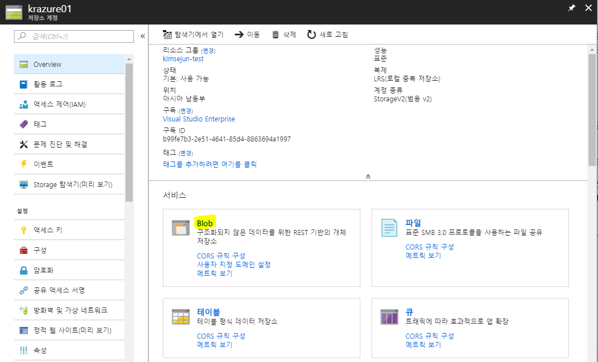

# 1.2 저장소 계정 만들기

Azure 저장소 계정은 데이터를 저장하기 위한 공간입니다. 크게 **blob, 파일, 테이블, 큐**로 구성되어 있으며, 각각의 저장 성격이 다르다.

저장소 계정은 크게 범용 저장소 계정과 Blob 저장소 계정으로 나누어 지며, 각각 저장소의 특징은 다음과 같다.

- **Storage(범용 v1)** : 위에서 설명한 blob, 파일, 테이블 큐를 가지는 일반적인 **표준 저장소 성능 계층**과, 가상 컴퓨터 디스크만 지원하는 **프리미엄 저장소 성능 계층**으로 나누어 진다.
- **StorageV2(범용 v2)** : __Storage(범용 v1)__ 과 기본적으로는 동일하지만, **Blob 저장소**와 같이 **핫 엑서스 계층**과 **쿨 엑서스 계층**을 선택할 수 있다.
- **Blob 저장소** : blob에 특화된 저장소 계정으로 자주 접근하는 **핫 엑서스 계층**으로 저렴한 접근 비용을 사용할 수 있으며, 가끔 접근하는 **쿨 엑서스 계층**으로 저렴한 데이터 저장 비용을 이점으로 가질 수 있다.

내구성 보장을 위해 **LRS(로컬 중복 복제)**, **ZRS(영역 중복 복제)**, **GRS(지역 중복 복제)**, **RA-GRS(읽기 전용 지역 중복 복제)** 로 설정이 가능하다.

자세한 내용은 [Azure 문서](https://docs.microsoft.com/ko-kr/azure/storage/storage-introduction)를 참고한다.

## 저장소 계정 만들기

1. [Azure 웹 콘솔](https://portal.azure.com)에 접속한다.

2. 좌측 메뉴에서 **저장소 계정**을 선택한다.
    - 좌측 메뉴에 **저장소 계정**이 없다면, 상단의 **모든 서비스**를 선택 한 후 **저장소 계정**을 검색하여 선택한다.
3. 블레이드에 **저장소 계정**창이 뜨면 상단에 **추가**버튼을 눌러서 **저장소 계정**을 생성한다.

4. **저장소 계정 만들기** 블레이드가 뜨면 **기본 사항**탭에 아래와 같이 설정을 입력하고 하단의 **다음: 고급**를 클릭한다.
    - `구독` : 저장소 계정을 생성할 구독을 선택한다.
    - `리소스 그룹` : 저장소 계정을 만들 리소스 그룹을 선택한다. 드롭 다운 메뉴에서 앞서 생성한 `krazure-rg`를 선택한다.
    - `저장소 계정 이름` : 표시될 저장소 계정 이름을 입력한다. 모든 지역에서 유일해야 한다. 여기서는 자주 사용하는 이름 또는 ID를 이용하여 `<이름 또는 ID>blob`을 입력한다.
    - `위치` : 가상 네트워크를 생성할 지역을 선택한다. 여기서는 `아시아 남동부`를 선택한다.
    - `성능` : **표준**과 **프리미엄**을 선택한다. 여기서는 **표준**을 선택한다.
        > [!메모]
        >
        > **프리미엄**을 선택하면 `복제`옵션에서 LRS만 선택할 수 있다.
    - `계정 종류` : 앞서 설명한 __Storage(범용 v1)__ 과 __StorageV2(범용 v2)__, 그리고 __Blob 저장소__ 를 선택한다. 여기서는 __StorageV2(범용 v2)__ 를 선택한다.
    - `복제` : 복제 설정이다. 여기서는 __LRS(로컬 중복 저장소)__ 를 선택한다.
    - `엑세스 계층(기본값)` : **쿨**과 **핫**을 선택한다. 여기서는 **핫**을 선택한다.

5. **저장소 계정 만들기** 블레이드의 **고급**탭에 아래와 같이 설정을 입력하고 하단의 **다음: 태그**를 클릭한다.
    - `보안 전송 필요` : 저장소 계정의 암호화 여부를 선택한다. 여기서는 **사용 안 함**을 선택한다.
    - `다음에서 엑세스 허용` : 가상 네트워크의 Endpoint를 설정하여 VM과 사설 통신을 할 수 있도록 설정하는 옵션이다. 여기서는 **사용 안 함**을 선택한다.
    - `계층 구조 네임스페이스` : 여기서는 선택할 수 없다.

6. **저장소 계정 만들기** 블레이드의 **태그**탭에는 아무것도 수정하지 않고 하단의 **다음: 검토 + 만들기**를 클릭한다.

7. **저장소 계정 만들기** 블레이드의 **검토 + 만들기**탭에서 상단에 `유효성 검사 통과`가 뜨면 생성 될 리소스의 정보를 확안한 후 하단의 **만들기**버튼을 클릭한다.

8. 배포가 진행되고 `배포가 완료됨`이라는 메세지가 뜨면 **리소스로 이동**버튼을 클릭하여 `<이름 또는 ID>blob`으로 이동한다.

9. 다음 그림과 같이 **서비스**항목에 **blob**을 선택한다.
 

10. 상단에 **컨테이너**를 클릭하여 다음과 같이 입력한 후 **확인**버튼을 클릭한다.
    - `이름`: 표시 될 컨테이너의 이름이다. 여기서는 `krazure-container`를 입력한다.
    - `액서스 형식`: 생성 할 컨테이너의 접근 정책을 정의한다. 여기서는 __컨테이너(컨테이너와 Blob에 대한 익명 읽기 엑세스)__ 를 선택한다.

11. 생성된 `krazure-container`를 클릭하여 컨테이너로 들어간다. `krazure-container`블레이드가 뜨면 상단에 **업로드**를 클릭한다.

12. 우측에 **Blob 업로드** 블레이드가 뜨면 아래와 같이 정보를 입력한 후 하단의 **업로드** 버튼을 클릭한다.
    > [!메모]
    >
    > 이 작업을 하기 전 [krazure_logo 이미지](../images/krazure_logo.png)를 다운로드 받아야 한다.
    - `파일`: 컨테이너에 업로드 할 파일을 선택한다. 우측의 **폴더 모양 아이콘**을 클릭하여 다운로드 받은 `krazure_logo.png`을 선택한다.
    > [!메모]
    >
    > Azure portal로는 100MB 이상의 파일을 업로드 할 수 없다.

13. 업로드가 완료되면 업로드 된 이미지 파일을 선택한다.

14. 우측 블레이드가 뜨면서 선택한 이미지 파일에 대한 속성이 나오는 것을 확인할 수 있으며, **URL**의 오른쪽 **복사 버튼** 을 클릭하여 URL을 복사한다.

15. 새로운 웹 브라우저를 띄워서 복사된 URL을 붙여넣기 하여 접속하면 이미지가 뜨는 것을 확인하실 수 있다.
    > [!메모]
    >
    > 이미지가 뜨지 않는다면 **Blob Container**에서 **액서스 정책**을 선택하여 **액서스 형식**이 Blob으로 되어있는지 확인한다.