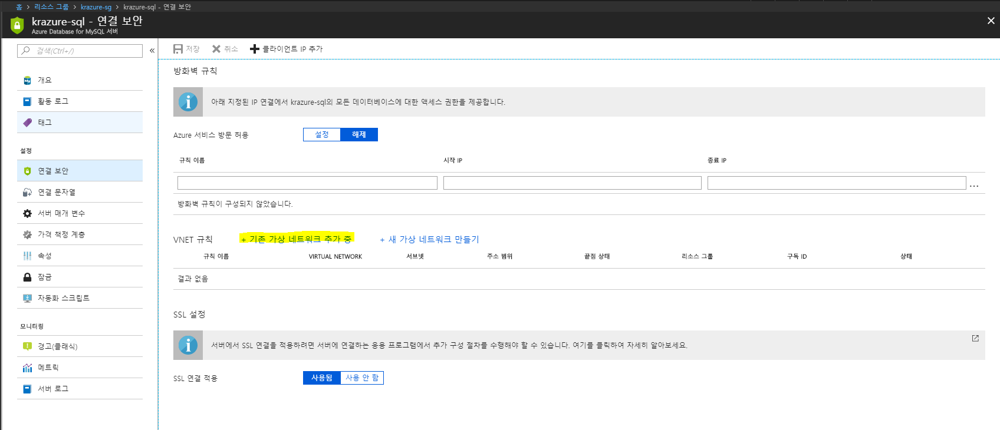
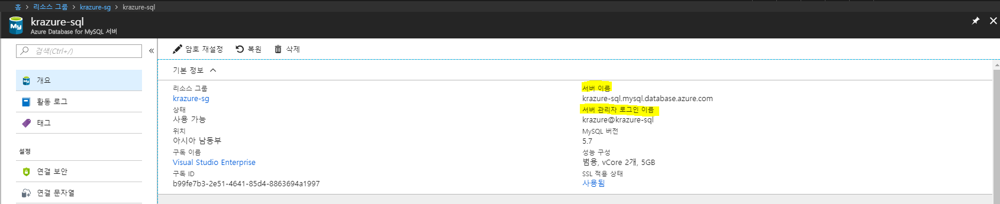
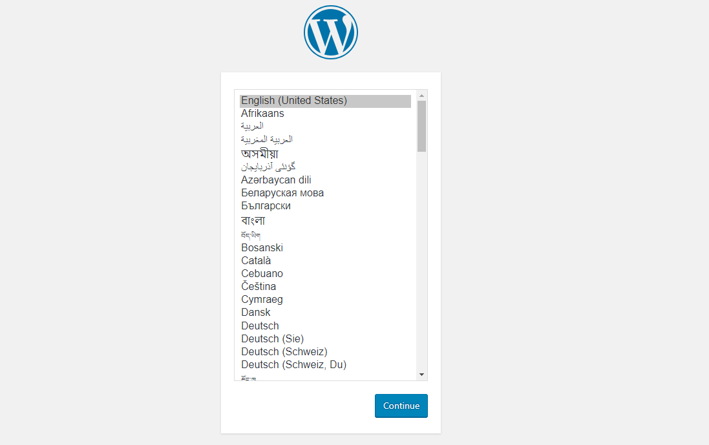

# 1.5 Azure MySQL Database를 구성하고 설치된 Wordpress에 Ubuntu 16.04 가상 컴퓨터에 MySQL 연결
Azure에는 관리형 데이터베이스를 서비스로 제공한다. 그 중 가장 기능이 많은 것은 단연 SQL Server를 서비스하는 Azure SQL Database이다. 하지만 오픈소스 진영을 추가로 지원하기 위해 Azure는 Azure MySQL Database와 Azure PostgreSQL Database를 추가한다. 세가지 모두 관리형 데이터베이스 이며 Azure에서는 가상 네트워크에 종속되지 않고 서비스로써 단독으로 사용할 수 있다.

MySQL Database와 PostgreSQL의 경우 기본적으로 보안 연결이 되어야 하며, 그로 인해 데이터베이스 연결이 SSL 연결을 기본적으로 권장한다. 따라서 DB Connection String을 사용할 때 SSL 연결 설정을 활성화 해야 하며, 그렇지 않기 위해서는 **연결 보안** 옵션을 수정해야 한다.

## Azure Database for MySQL 생성
1. [Azure 웹 콘솔](https://portal.azure.com)에 접속한다.

2. 좌측 메뉴에서 **리소스 만들기**를 클릭한다.

3. **새로 만들기** 블레이드 창이 뜨면 상단의 검색창에 `mysql database`를 입력한 후 엔트키를 입력한다.

4. 검색된 화면에서 `Azure Database for MySQL`를 찾아 클릭한다. 클릭하기 전 **게시자** 컬럼에 `Microsoft`로 되어있는지 다시 한 번 확인하자.

5. **Azure Database for MySQL** 블레이드 창이 뜨면 가볍게 내용을 확인한 후 하단에 **만들기**버튼을 클릭한다.

6. **MySQL** 서버 블레이드가 뜨면 아래와 같이 입력한 후 하단에 **만들기**버튼을 클릭한다.
    - `서버 이름`: 표시 될 MySQL Database 인스턴스의 이름을 입력한다. 이 이름은 고유해야 한다. 여기서는 자주 사용하는 이름 또는 ID를 이용하여 `<이름 또는 ID>-sql`을 입력한다.
    - `구독`: MySQL Database를 생성할 구독을 선택한다.
    - `리소스 그룹`: MySQL Database를 만들 리소스 그룹을 선택한다. **기존 그룹 사용**을 선택한 후 앞서 생성한 `krazure-rg`를 선택한다.
    - `소스 선택`: MySQL Database를 만들 때 입력할 데이터를 선택한다. 여기서는 **비어 있음**을 선택한다.
    - `서버 관리자 로그인 이름`: MySQL Database에 로그인할 계정을 입력한다. 여기서는 `krazure`를 입력한다.
    - `암호`: MySQL Database에 로그인할 계정의 비밀번호를 입력한다. 여기서는 `Passw.rd`를 입력한다.
    - `암호 확인`: `암호`에서 입력한 비밀번호를 다시 한번 입력한다.
    - `위치`: MySQL Database를 만들 리소스 그룹을 선택한다. **기존 그룹 사용**을 선택한 후 앞서 생성한 `krazure-rg`를 선택한다.
    - `버전`: MySQL Database 엔진 버전을 선택한다. 여기서는 **5.7**을 선택한다.
    - `가격 책정 계층`: MySQL Database 인스턴스의 가격 책정 계층을 선택한다. 여기서는 기본 값으로 둔다.

## 가상 네트워크와 통신할 수 있는 가상 네트워크 endpoint 설정
7. 앞서 생성한 MySQL Database 인스턴스가 생성이 완료되면 **리소스 그룹**에서 생성된 `<이름 또는 ID>-sql`를 클릭한다.

8. `<이름 또는 ID>-sql` 블레이드가 뜨면 **설정**에서 **연결 보안**을 클릭한다.

9. **연결 보안**내용이 뜨면 다음 그림과 같이 **VNET 규칙**에 **기존 가상 네트워크 추가 중**을 클릭한다.


10. 오른쪽에 **만들기** 블레이드가 뜨면 아래와 같이 입력한 후 하단에 **확인**버튼을 클릭한다.
    - `이름`: 가상 네트워크와 연결할 규칙의 이름을 입력한다. 여기서는 `krazure-sql-to-vnet`을 입력한다.
    - `구독`: 가상 네트워크가 있는 구독을 선택한다.
    - `가상 네트워크`: MySQL Database 인스턴스와 연결할 가상 네트워크를 선택한다. 여기서는 앞서 생성한 `krazure-vnet`을 선택한다.
    - `서브넷 이름/주소 접두사`: MySQL Database 인스턴스가 연결 될 서브넷을 선택한다. 여기서는 가상 컴퓨터가 생성되어 있는 `krazure-subnet / 10.0.0.0/24`을 선택한다.

## 가상 컴퓨터에 접속하여 Wordpress의 Database 연결 설정
11. **리소스 그룹** 블레이드로 돌아가에서 생성된 가상 컴퓨터인 `krazure-wp`를 선택한다.

12. `krazure-wp` 블레이드가 뜨면 다음 그림에서 보이는 **공용 IP 주소**를 복사한다.


13. putty 또는 bash를 실행하여 가상 컴퓨터에 SSH 접속을 한다.
    > [!메모]
    >
    > putty client는 [32bit](https://the.earth.li/~sgtatham/putty/latest/w32/putty.exe)와 [64bit](https://the.earth.li/~sgtatham/putty/latest/w64/putty.exe) 중 OS에 맞는 Client를 다운로드 받는다. MAC OS X는 기본적으로 Bash가 내장이고, Windows에 Bash shell이 설치되어 있다면, 다음 명령어를 사용하여 접근이 가능하다.
    > ```bash
    > $ ssh -i vm_privatekey.pem krazure@<가상 컴퓨터의 공용 IP 주소>
    > ```

    > [!메모]
    > 
    > key-pair는 bash에서 접근 가능한 [vm_privatekey.pem](../source/key-pair/vm_privatekey.pem) 파일과 putty에서 접근 가능한 [vm_privatekey.ppk](../source/key-pair/vm_privatekey.ppk) 파일 중 알맞는 파일을 다운로드 한다.

14. 다음 명령어를 사용하여 가상 컴퓨터에 mysql client를 설치한다.
    ```bash
    $ sudo apt install -y mysql-client
    ```

15. 다음 명령어를 사용하여 MySQL Database에 연결한다.
    ```bash
    $ mysql -h <MySQL Database 인스턴스의 서버 이름> -u <MySQL Database 인스턴스의 서버 관리자 로그인 이름> -p
    ```
    > [!메모]
    >
    > 앞서 생성한 MySQL Database 인스턴스(`<이름 또는 ID>-sql`) 블레이드로 이동하면 더욱 작업이 수월하다. 위에서 언급한 `<MySQL Database 인스턴스의 서버 이름>`과 `<MySQL Database 인스턴스의 서버 관리자 로그인 이름>`은 다음 그림을 확인하자
    > 

16. 다음 명령어를 사용하여 MySQL Database 인스턴스에 `wordpressdb`라는 이름의 Database를 생성한다. 그리고 MySQL CLI를 종료한다.
    ```mysql
    mysql> CREATE DATABASE wordpressdb DEFAULT CHARACTER SET utf8 COLLATE utf8_unicode_ci;
    mysql> FLUSH PRIVILEGES;
    mysql> EXIT;
    ```

17. 다음 명령어를 사용하여 Wordpress의 환경설정이 들어있는 `wp-config.php`파일을 수정한다.
    ```bash
    $ sudo vi /var/www/html/wp-config.php
    ```

18. 다음과 같이 26번 라인의 'username_here'는 `<MySQL Database 인스턴스의 서버 관리자 로그인 이름>`으로, 32번 라인의 'localhost'는 `<MySQL Database 인스턴스의 서버 이름>`으로 수정한다. 아래는 예제이다.
    ```example
    define('DB_USER', 'krazure@krazure-sql');
    define('DB_HOST', 'krazure-sql.mysql.database.azure.com');
    ```

19. `krazure-wp` 가상 컴퓨터의 **공용 IP 주소**를 복사하여 웹 브라우저에 붙여넣는다. 아래와 같은 화면이 뜬다면 Wordpress의 설정이 완료되었다. 다음 작업을 위해 Wordpress를 초기화 하고, 게시판을 추가하거나 테마를 바꾸는 등 작업을 진행하자.


    > [!메모]
    >
    > Wordpress를 초기화할 시 ID와 PW를 꼭 저장해 놓자.