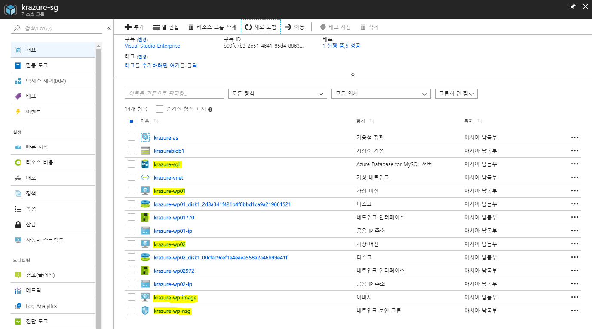

# 1.6 가상 컴퓨터 초기화 및 재배포

가상 컴퓨터를 똑같이 구성할 수 있지만, Azure에서는 기존 가상 컴퓨터를 이미지화 하여 복제할 수 있다. 그러기 위해서는 가상 컴퓨터를 초기화 작업을 거친 후 캡처를 통해 이미지를 만들고, 만들어진 이미지를 가지고 새로운 가상 컴퓨터를 배포한다.

가상 컴퓨터를 이미지로 생성하게 되면 Auto Scale Set에도 설정할 수 있어 가상 컴퓨터를 복제하기 용이하다.

## 가상 컴퓨터 초기화

1. `krazure-wp` 가상 컴퓨터에 접속한다.

2. 다음 명령어를 사용하여 가상 컴퓨터를 초기화 한다.
    ```bash
    sudo waagent -deprovision+user
    ```
    ```결과
    WARNING! The waagent service will be stopped.
    WARNING! Cached DHCP leases will be deleted.
    WARNING! root password will be disabled. You will not be able to login as root.
    WARNING! /etc/resolvconf/resolv.conf.d/tail and /etc/resolvconf/resolv.conf.d/original will be deleted.
    WARNING! krazure account and entire home directory will be deleted.
    Do you want to proceed (y/n)y
    ```

3. `krazure-wp` 가상 컴퓨터와 접속을 끊는다.

4. [Azure 웹 콘솔](https://portal.azure.com)에 접속하여 `krazure-wp` 가상 컴퓨터 리소스를 찾는다.

5. `krazure-wp` 가상 컴퓨터를 중지한다.

## 초기화 된 가상 컴퓨터로 이미지 만들기

1. `krazure-wp` 가상 컴퓨터의 중지가 완료되면 다음 그림과 같이 **캡처**를 클릭한다.
 

2. **이미지 만들기** 블레이드가 뜨면 아래와 같이 입력한 후 아래쪽에 **만들기**버튼을 클릭한다.
    - `이름`: 가상 컴퓨터 이미지의 이름을 입력한다. 여기서는 `krazure-wp-image`라고 입력한다.
    - `리소스 그룹`: 가상 컴퓨터 이미지를 저장할 리소스 그룹을 선택한다. 여기서는 `krauzre-rg`을 선택한다.
    - `이미지를 만든 후 이 가상 머신을 자동으로 삭제`: 말 그대로 원본 가상 컴퓨터를 삭제하는 옵션이다. 초기화가 진행된 가상 컴퓨터는 복구가 되지 않으니 과감하게 체크하자.
    - `영역 복원력`: 생성된 가상 컴퓨터 이미지를 모든 가용성 영역에서 사용할 수 있도록 하는 옵션이다. 여기서는 **끄기**를 선택한다.

3. 가상 컴퓨터 이미지가 다 만들어지면 `krauzre-rg`에서 `krazure-wp` 가상 컴퓨터를 지운 후 남은 리소스를 정리한다. 목록은 아래와 같다.
    ```content
    디스크
    네트워크 인터페이스
    공용 IP 주소
    ```
    

    > [!메모]
    >
    > 리소스 삭제는 상단에 **태그 지정**오른쪽에 있는 **삭제**를 이용한다.

## 생성된 이미지로 가상 컴퓨터 두 대 배포하기

1. `krauzre-rg`에서 `krazure-wp-image`를 찾아 클릭한다.

2. 상단에 **VM 만들기**를 클릭하여 `krazure-wp01`로 가상 컴퓨터를 만든다. 가상 컴퓨터를 만들 시 **네트워킹**탭에서 **네트워크 보안 그룹**옵션을 **고급**으로 선택한 후 생성해둔 `krazure-wp-nsg`를 선택하고, **게스트 구성**탭에서 **확장**은 **확장 없음**으로 만든다.
    > [!메모]
    >
    > 가상 컴퓨터를 만드는 방법은 [#1.4 Ubuntu 16.04 가상 컴퓨터에 Wordpress 설치](https://github.com/krazure/workshop-itpro-101/blob/master/hands-on-lab/1.4_building_wordpress_on_VM.md#custom-script-for-linux%EB%A5%BC-%EC%82%AC%EC%9A%A9%ED%95%98%EB%8A%94-ubuntu-1604-%EA%B0%80%EC%83%81-%EC%BB%B4%ED%93%A8%ED%84%B0-%EB%A7%8C%EB%93%A4%EA%B8%B0)를 참고한다.

3. 2.와 같은 방법으로 `krazure-wp02` 가상 컴퓨터를 만든다.

4. 가상 컴퓨터가 전부 생성이 완료되면 다음과 같은 `krauzre-rg` 리소스 그룹의 리소스를 볼 수 있다.
 