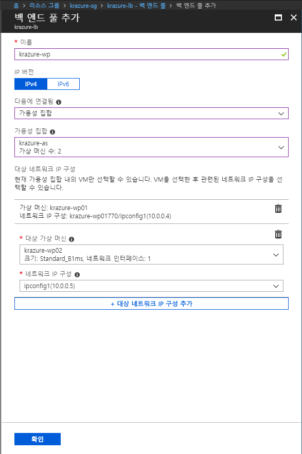

# 1.7 Azure Load Balancer를 이용한 Wordpress 이중화 구성
기본적으로 Cloud를 사용하게 되면 모든 서버는 이중화 이상 구성이 될 수 있도록 응용프로그램을 수정해야 하며, 인프라는 그에 맞도록 설정을 구성할 수 있어야 한다. 여기서는 L4 기반의 부하 분산 장치인 Load Balancer를 이용하여 Wordpress를 이중화 구성하는 방법에 대해 알아본다.

## Azure Load Balancer 만들기
1. [Azure 웹 콘솔](https://portal.azure.com)에 접속한다.

2. 좌측 메뉴에서 **리소스 만들기**를 클릭한다.

3. **새로 만들기** 블레이드 창이 뜨면 상단의 검색창에 `load balancer`를 입력한 후 엔트키를 입력한다.

4. 검색된 화면에서 `부하 분산 장치`를 찾아 클릭한다. 클릭하기 전 **게시자** 컬럼에 `Microsoft`로 되어있는지 다시 한 번 확인하자.

5. **부하 분산 장치** 블레이드 창이 뜨면 가볍게 내용을 확인한 후 하단에 **만들기** 버튼을 클릭한다.

6. **부하 분산 장치 만들기** 블레이드가 뜨면 아래와 같이 입력한 후 하단에 **만들기** 버튼을 클릭한다.
    - `이름`: 부하 분산 장치의 이름을 입력한다. 여기서는 `krazure-lb`로 입력한다.
    - `형식`: 부하 분산 장치의 위치를 선택한다. 여기서는 **공개**를 선택한다.
    - `SKU`: 부하 분산 장치의 SKU를 선택한다. 가용성 영역을 사용하지 않기 때문에 **기본**을 선택한다.
    - `공용 IP 주소`: 부하 분산 장치에 연결 될 공용 IP 주소를 선택한다. 여기서는 **새로 만들기**를 선택한 후 텍스트 박스에는 `krazure-lb-pip`로 입력하고, **할당**은 **정적**을 선택한다.
    - `구독`: 부하 분산 장치를 만들 구독을 선택한다.
    - `리소스 그룹`: 부하 분산 장치를 만들 리소스 그룹을 선택한다. 여기서는 `krazure-rg`을 선택한다.
    - `위치`: 부하 분산 장치를 생성할 지역을 선택한다. 여기서는 `아시아 남동부`를 선택한다.

## Azure Load Balancer 설정
7. **부하 분산 장치**의 생성이 완료되면 `krazure-rg` 리소스 그룹에서 `krazure-lb` 리소스를 찾아 클릭한다.

8. `krazure-lb` 블레이드에서 **설정**부분에 **백 엔드 풀**을 클릭한다.

9. 상단에 **추가**버튼을 클릭한 후 나오는 **백 엔드 풀 추가** 블레이드에서 아래와 같이 입력한 후 **확인**버튼을 클릭한다.
    - `이름`: 백 엔드 풀의 이름을 입력한다. 여기서는 `krazure-wp`로 입력한다.
    - `IP 버전`: 백 엔드 풀이 통신할 IP 버전을 선택한다. 여기서는 **IPv4**를 선택한다.
    - `다음에 연결됨`: 백 엔드 풀에 연결할 리소스를 선택한다. 여기서는 **가용성 집합**을 선택한다.
    - `가용성 집합`: 백 엔드 풀에 연결할 가용성 집합을 선택한다. 여기서는 드롭다운 메뉴를 클릭하여 `krazure-as`을 선택한다.
    - `대상 네트워크 IP 구성`: 백 엔드 풀에 연결한 가용성 집합에 있는 가상 컴퓨터의 IP를 선택한다. **대상 네트워크 IP 구성 추가**를 클릭하여 다음 그림과 같이 사용성 집합에 있는 모든 IP를 연결한다.
    

9. 백 엔드 풀 구성이 완료되면 **설정**부분에 **상태 프로브**를 클릭한다.

10. 상단에 **추가**버튼을 클릭한 후 나오는 **상태 프로브 추가** 블레이드에서 아래와 같이 입력한 후 **확인**버튼을 클릭한다.
    - `이름`: 프로브의 이름을 입력한다. 여기서는 `krazure-prob`로 입력한다.
    - `프로토콜`: 백 엔드 풀에 프로브를 실행 할 프로토콜을 선택한다. 여기서는 **HTTP**를 선택한다.
    - `포트`: 백 엔드 풀에 프로브를 실행 할 포트을 입력한다. 여기서는 `80`을 입력한다.
    - `경로`: 백 엔드 풀에 프로브를 실행 할 경로을 지정한다. 여기서는 `/`를 입력한다.
    - `간격`: 백 엔드 풀에 프로브를 실행 할 때 Interval time을 지정한다. 기본 값을 쓴다.
    - `비정상 임계값`: 백 엔드 풀에 프로브를 실행 할 때 Health check가 실패한 횟수를 지정한다. 비정상을 검출할 때 사용하는 값이다. 기본 값을 쓴다.

11. 상태 프로브 구성이 완료되면 **설정**부분에 **부하 분산 규칙**를 클릭한다.

12. 상단에 **추가**버튼을 클릭한 후 나오는 **부하 분산 규칙 추가** 블레이드에서 아래와 같이 입력한 후 **확인**버튼을 클릭한다.
    - `이름`: 부하 분산 규칙 이름을 입력한다. 여기서는 `krazure-lb-role`을 입력한다.
    - `IP 버전`: 부하 분산 규칙이 동작하는 IP 버전을 선택한다. 여기서는 **IPv4**를 선택한다.
    - `프런트 엔드 IP 주소`: 부하 분산 규칙의 프런트 엔드 IP 주소를 선택한다. 기본 값을 쓴다.
    - `프로토콜`: 부하 분산 규칙에서 사용할 프로토콜을 선택한다. 여기서는 **TCP**를 선택한다.
    - `포트`: 부하 분산 규칙에서 사용할 포트를 입력한다. 여기서는 `80`을 입력한다.
    - `백 엔드 포트`: 부하 분산 규칙에서 백 엔드 풀로 넘길 포트를 입력한다. 여기서는 `80`을 입력한다.
    - `백 엔드 풀`: 부하 분산 규칙에서 사용할 백 엔드 풀을 선택한다. 여기서는 `krazure-wp`를 선택한다.
    - `상태 프로브`: 부하 분산 규칙에서 사용할 상태 프로브를 선택한다. 여기서는 `krazure-prob`를 선택한다.
    - `세션 지속성`: 부하 분산 장치가 세션을 지속하는 옵션을 선택한다. 여기서는 기본 값을 쓴다.
    - `유휴 제한 시간(분)`: 부하 분산 장치가 세션을 효율적으로 쓰기 위해 유휴 제한 시간을 입력한다. 여기서는 기본 값을 쓴다.
    - `유동 IP(Direct Server Return)`: SQL AlwaysOn 구성시 사용하는 옵션이다. 여기서는 기본 값을 쓴다.

13. 부하 분산 규칙 구성이 완료되면 **개요**를 클릭하여 부하 분산 장치의 공용 IP 주소를 복사하여 웹 브라우저에 붙여넣는다. 그리고 앞서 설정한 Wordpress가 정상적으로 뜨는지 확인한다.