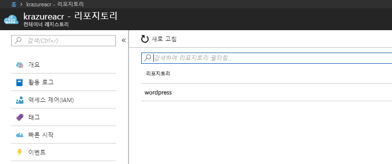

# 2.2 Azure Container registry에 Wordpress image 업로드
Azure에는 Acure Container registry(ACR)이라는 docker image 저장소가 있다. 이 저장소는 Azure에서 제공하는 private registry이며, 그로 인해 docker image를 안전하게 보관할 수 있고, 다른 docker 환경에 docker image를 배포할 때 사용할 수도 있다.

ACR에 로그인하는 방법은 크게 두 가지 이다. Azure CLI를 통해 로그인하는 방법과 관리자 계정을 활성화 하여 `docker login` 명령어로 ID/PW 접근이 가능하다. 여기서는 Azure CLI를 이용하여 ACR에 로그인 하고 wordpress docker image를 ACR에 업로드 하는 방법에 대해 알아본다.

## ACR 만들기
1. [Azure 웹 콘솔](https://portal.azure.com)에 접속한다.

2. 좌측 메뉴에서 **리소스 만들기**를 클릭한다.

3. **새로 만들기** 블레이드 창이 뜨면 상단의 검색창에 `container registry`를 입력한 후 엔트키를 입력한다.

4. 검색된 화면에서 `Container Registry`를 찾아 클릭한다. 클릭하기 전 **게시자** 컬럼에 `Microsoft`로 되어있는지 다시 한 번 확인하자.

5. **Container Registry** 블레이드 창이 뜨면 가볍게 내용을 확인한 후 하단에 **만들기** 버튼을 클릭한다.

6. **컨테이너 레지스트리 만들기** 블레이드가 뜨면 다음과 같이 정보를 입력한 후 하단에 **만들기**버튼을 클릭한다.
    - `레지스트리 이름` : 컨테이너 레지스트리가 표시될 이름을 입력한다. 이 이름은 전 세계에서 유일해야 한다. 여기서는 자주 사용하는 이름 또는 ID를 이용하여 `<이름 또는 ID>acr`을 입력한다.
    - `구독` : 컨테이너 레지스트리를 생성할 구독을 선택한다.
    - `리소스 그룹` : 컨테이너 레지스트리를 만들 리소스 그룹을 선택한다. 여기서는 `krazure-rg`을 선택한다.
    - `위치` : 컨테이너 레지스트리를 생성할 지역을 선택한다. 여기서는 **아시아 남동부**를 선택한다.
    - `관리 사용자` : 컨테니어 레지스트리를 docker login 명령을 이용하여 사용할 수 있는 옵션이다. 여기서는 **사용**을 선택한다.
    - `SKU` : 컨테이너 레지스트리의 과금을 선택한다. 여기서는 표준을 선택한다.

7. `<이름 또는 ID>acr`이 배포가 완료되면 가볍게 리소스에 대한 메뉴를 살펴본다.

## Wordpress 이미지를 ACR에 올리기
8. `krazure-wp01` 가상 컴퓨터에 접속한다.

9. 다음 명령을 사용하여 `Azure CLI 2.0`을 인증한다.
    ```Azurecli
    az login
    ```

10. 명령어 실행 후 웹 브라우저로 출력된 [URL](https://aka.ms/devicelogin)에 접속한다.

11. **Devicr Login** 페이지가 뜨면 출력된 9자리의 코드를 복사하여 입력한다.

12. **Microsoft Azure Cross-platform Command Line Interface** 라는 메세지와 함께 생성된 화면에서 **Continue**를 클릭한다.

13. 로그인 창이 뜨면 Azure 계정으로 로그인한다.

14. **Microsoft Azure Cross-platform Command Line Interface** 이라는 메세지와 함께 인증이 완료되었다는 창이 뜨면 웹 브라우저를 닫고 다시 CLI 창으로 돌아오면 인증이 완료된 것을 확인할 수 있다.
    > [!메모]
    >
    > JSON형식으로 출력된 값이 두 개 이상인 경우 로그인 한 계정에 연결된 구독(subscription)이 두 개 이상인 경우이다. 이 때 아래와 같은 명령어를 사용하여 특정 구독을 사용하겠다는 정의를 별도로 해 주어야 한다.
    > ```Azurecli
    > az account set --subscription "<Subscription ID>"
    > ```

15. 다음 명령어를 사용하여 생성한 ACR에 로그인한다.
    ```Azurecli
    $ sudo az acr login --name <이름 또는 ID>acr
    ```
    ```결과
    $ sudo az acr login --name krazureacr
    Login Succeeded
    ```

16. Docker 이미지를 ACR에 배포하려면 Docker 이미지에 Tag를 부여해야 한다. 다음 명령어를 사용하여 로그인한 ACR의 `loginserver` 이름을 가져온다.
    ```Azurecli
    $ az acr show --name <이름 또는 ID>acr --query loginServer
    ```
    ```결과
    $ az acr show --name krazureacr --query loginServer
    "krazureacr.azurecr.io"
    ```

17. 다음 명령어를 사용하여 `16번`에서 출력된 `loginserver`로 Tag를 지정한다.
    ```bash
    $ sudo docker tag wordpress <ACR loginserver>/wordpress
    ```

18. 다음 명령어를 이용하여 docker 이미지에 어떤 Tag가 연결되었는지 확인한다.
    ```bash
    $ sudo docker images
    ```
    ```결과
    $ sudo docker images
    REPOSITORY                        TAG                 IMAGE ID            CREATED             SIZE
    krazureacr.azurecr.io/wordpress   latest              c5714bb36634        27 minutes ago      353 MB
    wordpress                         latest              c5714bb36634        27 minutes ago      353 MB
    wpinit                            latest              322ce70a5333        11 hours ago        294 MB
    ubuntu                            16.04               7aa3602ab41e        2 weeks ago         115 MB
    ```

19. 이제 tag가 달린 Docker 이미지를 ACR에 push 하자. 다음 명령어를 이용하여 Tag를 지정한 **wordpress** 이미지를 ACR에 push한다.
    ```bash
    $ sudo docker push <ACR loginserver>/wordpress
    ```
    ```결과
    $ sudo docker push krazureacr.azurecr.io/wordpress
    The push refers to a repository [krazureacr.azurecr.io/wordpress]
    3dfd20e83e3e: Pushed
    c6f5bf2ccbbf: Pushed
    e14e83b9c147: Pushed
    bcff331e13e3: Pushed
    2166dba7c95b: Pushed
    5e95929b2798: Pushed
    c2af38e6b250: Pushed
    0a42ee6ceccb: Pushed
    latest: digest: sha256:a82b3366df30c4beabac2f6af0128c581699a082fc04e49288b53c40ed8b3bbe size: 1991
    ```

20. 다음 명령어를 사용하여 ACR에 정상적으로 docker image가 업로드 되었는지 확인한다.
    ```Azurecli
    $ az acr repository list --name <이름 또는 ID>acr
    ```
    ```결과
    $ az acr repository list --name krazureacr
    [
    "wordpress"
    ]
    ```
    > [!메모]
    >
    > Azure portal에서 다음과 같이 확인할 수 있다.
    > 