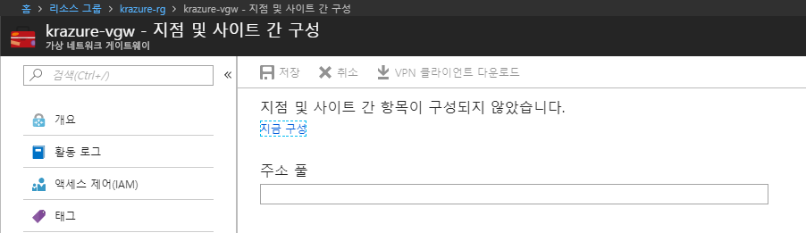
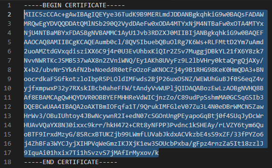
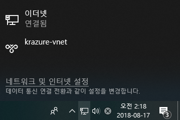
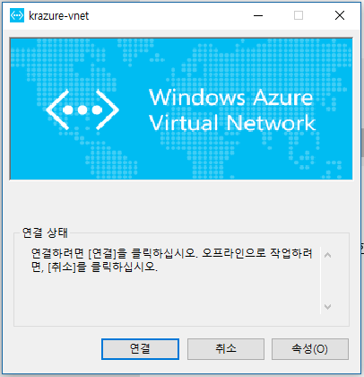

# 2.7 VPN을 이용하여 VM에 접속하기
가상 네트워크 게이트웨이를 이용하여 VPN을 설정하려면 기본적으로 인증서가 필요하다. 인증서를 만드는 방법은 [이 링크](https://docs.microsoft.com/ko-kr/azure/vpn-gateway/vpn-gateway-certificates-point-to-site)를 참고하여 생성하도록 하자.

여기서는 생성된 인증서를 사용하여 가상 네트워크 게이트웨이에 VPN 연결을 하는 방법에 대해 알아보자. 기본적으로 Windows Client에 대해 설명하며, Linux 또는 MAC OS X의 경우 

## Azure Container Instance 배포하기
1. [Azure 웹 콘솔](https://portal.azure.com)에 접속한다.

2. `krazure-rg` 리소스 그룹에서 `krazure-vgw` 리소스를 찾아 클릭한다.

3. `krazure-vgw` 블레이드 메뉴에서 **설정**영역에 **지점 및 사이트 간 구성**을 클릭한다.

4. 다음과 같은 그림이 뜨면 **지금 구성**을 클릭한다.

5. 다음과 같이 입력한 후 상단에 **저장**을 클릭한다.
    - `주소 풀`: VPN Client가 할당받을 IP CIDR을 입력한다. 이 값은 가상 네트워크에서 사용하지 않는 IP대역이어야 한다. 여기서는 `172.16.82.0/24`를 입력한다.
    - `터널 종류`: VPN 터널 종류를 선택한다. __SSL VPN(SSTP)__ 과 **IKEv2 VPN** 둘 다 체크한다.
    - `인증 형식`: VPN 인증 방식을 선택한다. 여기서는 **Azure 인증서**를 선택한다.
    - `루트 인증서`: VPN 인증을 위한 루트 인증서를 입력한다. `이름`은 `P2SRootCert`로 입력하고 `공용 인증서 데이터`는 [여기](../cert/P2SRootCert.cer)에서 **본문**만 입력한다.
    - `해지된 인증서`: VPN 인증서를 명시적으로 제거할 때 입력한다. 여기서는 입력하지 않는다.
    > [!메모]
    >
    > 인증서의 **본문**은 `-----BEGIN CERTIFICATE-----`과 `-----END CERTIFICATE-----`를 제외한 나머지 이다. 아래 이미지를 참고하자
    > 

6. 저장이 완료되면 상단에 **VPN 클라이언트 다운로드**를 클릭하여 VPN 클라이언트를 다운로드 한다. **VPN 클라이언트 다운로드**를 클릭하면 Azure에서는 파일을 생성한 후 다운로드를 시작하기 때문에 생각보다 오랜 시간을 기다려야 한다.

7. [여기](../cert/P2SChildCert.pfx)에 첨부된 인증서를 다운로드 받아 Windows에 설치한다. 인증서 비밀번호는 `Passw.rd`이다.
    > [!메모]
    >
    > 인증서 설치는 Windows에서만 지원한다. Linux 또는 MAC OS X는 [이 링크](https://docs.microsoft.com/ko-kr/azure/vpn-gateway/point-to-site-how-to-vpn-client-install-azure-cert)를 참고하자.

8. 다운로드 받은 VPN 클라이언트 압축파일을 풀고 `\WindowsAmd64\VpnClientSetupAmd64.exe` 파일을 실행한다. 경고창이 뜨지만 무서워하지 않고 모두 **확인**을 눌러준다.
    > [!메모]
    >
    > 여기서부터는 Windows 컴퓨터만 따라해야 한다. Linux나 MAC OS X는 [이 링크](https://docs.microsoft.com/ko-kr/azure/vpn-gateway/point-to-site-vpn-client-configuration-azure-cert)를 참고하여 설정하자.

9. 오른쪽 아래 네트워크를 클릭하면 다음과 같이 `krazure-vnet`이라는 VPN 연결을 확인할 수 있다. 클릭하여 설정으로 이동하자

10. 설정 창이 뜨면 다음과 같이 **연결**버튼을 클릭하여 VPN을 연결하자

11. VPN이 연결되면 [Azure 웹 콘솔](https://portal.azure.com)로 돌아와 `krazure-rg` 리소스 그룹에서 `krazure-wp01` 리소스를 찾아 클릭한다.

12. `krazure-wp01` 블레이드 메뉴에서 **설정**영역에 **네트워킹**을 클릭한다.

13. **개인 IP**를 복사하여 웹 브라우저에 붙여 넣어 wordpress가 뜨는지 확인한다.